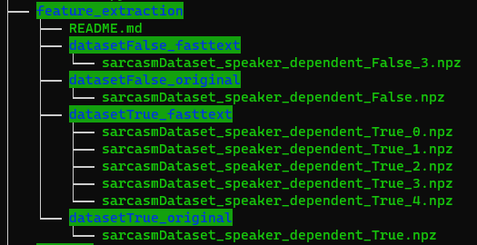

# Table of contents <!-- omit from toc --> 

- [Introduction](#introduction)
- [Setup](#setup)
  - [Clone the repository](#clone-the-repository)
  - [Obtain the data](#obtain-the-data)
  - [Fix Windows file permission issue](#fix-windows-file-permission-issue)
- [Start the container](#start-the-container)

# Introduction

This repository was created for a project based on the paper [Sentiment and Emotion help Sarcasm? A Multi-task Learning Framework for Multi-Modal Sarcasm, Sentiment and Emotion Analysis](https://www.aclweb.org/anthology/2020.acl-main.401/), which investigates the influence of sentiment and emotion information on the task of automatic sarcasm detection in a multimodal setting using a deep neural network model with attention mechanism. The following explains the necessary steps to set up a Jupyter Notebook environment with Docker to test the model.

# Setup

This setup is based on a Windows 10 host system that uses WSL2. It is assumed that Ubuntu is used as WSL2 instance and Docker Desktop is installed and set up on Windows.

Created and tested with the following versions:

- Ubuntu 22.04.2 LTS
- Docker Desktop V4.19.0

It should not depend on these exact versions as they just provide a base system. All configuration of tools is provided as Docker image.

## Clone the repository

```
git clone https://github.com/vivi-alencar/sarcasm-2023
cd sarcasm-2023/
```

## Obtain the data

This repository uses the dataset from the paper [Sentiment and Emotion help Sarcasm? A Multi-task Learning Framework for Multi-Modal Sarcasm, Sentiment and Emotion Analysis](https://www.aclweb.org/anthology/2020.acl-main.401/), which in turn uses data from [Towards Multimodal Sarcasm Detection (An Obviously Perfect Paper)](https://www.aclweb.org/anthology/P19-1455/)

The links to the datasets can be obtained from the repository https://github.com/GussailRaat/ACL2020-SE-MUStARD-for-Multimodal-Sarcasm-Detection#feature-extraction

The dataset files should be stored according to the structure shown in the image below:



## Fix Windows file permission issue

The container uses the repository directory as the home directory within the container. If the repository directory is stored within the Windows file system while the container is being run from WSL2 there is a file permission issue that prevents the container from starting. 

This can be prevented by mounting the Jupyter runtime from the Linux filesystem instead. Create the required directory in your WSL2 environment:

```
mkdir -p ~/.local/share/jupyter/runtime
```

# Start the container

Start the container from a WSL2 bash. It is required that Docker Desktop is running on the Windows host.

Use the following command to mount the workspace as home within the container. A specific container version is used to ensure future updates to the container will not break the program.

```
docker run -u $(id -u):$(id -g) -it --gpus all -p 8888:8888 -v $(pwd):/home/jovyan -v /home/$(whoami)/.local/share/jupyter/runtime:/home/jovyan/.local/share/jupyter/runtime/ jupyter/tensorflow-notebook:2023-05-08
```

<!--
```
docker run -u $(id -u):$(id -g) -it --gpus all -p 8888:8888 -e GRANT_SUDO=yes --user root -v $(pwd):/home/jovyan -v /home/$(whoami)/.local/share/jupyter/runtime:/home/jovyan/.local/share/jupyter/runtime/ fleitner/testrepo
```

Granting the user sudo privileges is not strictly required but makes development easier as packages can be installed on the fly. However, it also creates a security risk if exposed. To mitigate the container must only be run locally, never in a network or cloud environment.
-->